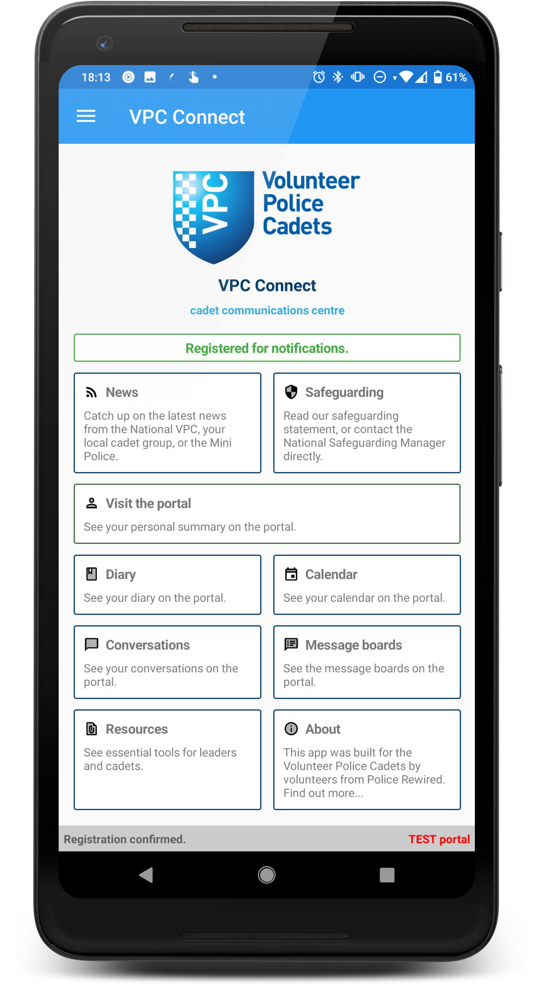

# VPC Connect

This is forked code
** Use branch updating to help move from .NET MANUI 7 TO .NET MANUI 9

## Update

**2023-05-21.** The rewrite of this app to use the .NET MAUI framework has recently completed. See: [Issue #2](https://github.com/PoliceRewired/vpc-connect/issues/2)

## Overview

This app is a communications tool for users of the Marshall Volunteer Portal (MVP), a service provided by the Volunteer Police Cadets (VPC).

Users may use it to:

* Register to receive push notifications from the MVP.
* Read and manage their notifications.
* Access key information quickly and easily.
* View news and updates.

VPC Connect is a cross-platform app built for Android and iOS. The code is written in C#, and makes use of these frameworks and supporting technologies:

* .NET 7.0 MAUI framework
* Firebase Cloud Messaging (FCM)
* Apple Push Notifications Service (APNS)

For more information:

* [VPC Connect developer documentation](https://policerewired.github.io/vpc-connect/) from this repository
* [VPC Connect project page](https://www.policerewired.org/home/projects/vpc-connect) at Police Rewired

## Contributing to VPC Connect

This project is has been open sourced under the MIT license:

* to permit community contributions to the application,
* to make it easy for interested parties to inspect and offer feedback,
* to develop trust in the application and its behaviour.

The source code is maintained by volunteers through [Police Rewired](https://policerewired.org).

### How to contribute

**Beginners are welcome!** It doesn't matter if this is your first or 100th open source contribution - we'd be glad to walk you through the process.

If you would like to contribute to the project:

* Have a think about what you'd like to do. There are plenty of ways to improve this project or others.
* Reach out to volunteers at [Police Rewired](https://policerewired.org) and let us know what you'd like to do.
  * Discord ([invite](https://bit.ly/PoliceRewired-join-discord)), or
  * Email [team@policerewired.org](mailto:team@policerewired.org)

All code must be reviewed by at least one repository owner before it can be merged into the `main` branch - and then used in future releases.

#### Documentation

When preparing to start work on a patch or a new feature, read through [the documentation](https://policerewired.github.io/vpc-connect/) (found in the `docs/` folder) to ensure you understand how things are intended to work.

#### New issues

* If you've spotted an issue you'd like to fix, first [check to see](https://github.com/PoliceRewired/vpc-connect/issues) if it's already known.
* If not, [create an issue](https://github.com/PoliceRewired/vpc-connect/issues/new/choose) so everyone can see it.

#### Creating a pull request

* First, take a look around the project code online: https://github.com/PoliceRewired/vpc-connect
* When you're ready, [fork the project](https://github.com/PoliceRewired/vpc-connect/fork) into your own Github space
* Clone your new repository to your development machine
* Checkout a new branch for your change
* Make your changes
* Add, and commit those changes
* Push to your local branch
* Submit a pull request from your branch to our `main` branch with details of your change
* [Link your pull request to the issue](https://docs.github.com/en/issues/tracking-your-work-with-issues/linking-a-pull-request-to-an-issue) it relates to

## Code of conduct

To represent yourself to your very best ability online, you must always practice:

* No harassment
* No discrimination
* No inappropriate imagery or content

Harassment includes but is not limited to offensive verbal or written comments related to gender, age,
sexual orientation, disability, physical appearance, body size, race, religion, sexual images in public spaces,
deliberate intimidation, stalking, following, harassing photography or recording, sustained disruption of talks
or other events, inappropriate physical contact, and unwelcome sexual attention.

**If what you’re doing is making someone feel uncomfortable, that counts as harassment and is enough reason to stop doing it.**

Read: [code of conduct](https://www.policerewired.org/home/conduct)
