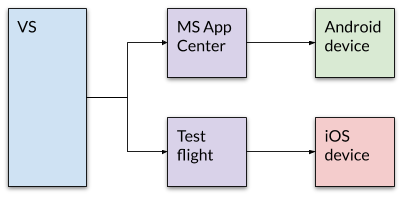

# Building the app

## Build

The project is built with Visual Studio, with mobile development features enabled (Xamarin).

The build requires access to XCode for the iOS app. This can be either installed on the local machine, or provided through an XCode server.

### Android

In VS, with the **Android** project selected, in **Release** mode, and _any device:_

* Build with: `Build` / `Build Solution`
* Archive with: `Build` / `Archive for Publishing`

### iOS

In VS, with the **iOS** project selected, in **Release** mode, and a **Generic Device:**

* Build with: `Build` / `Build Solution`
* Archive with: `Build` / `Archive for Publishing`

## Test distribution

* The Android app is built, signed for release, and distributed through the Microsoft App Center.
* The iOS app is built against the appropriate distribution profile, and then uploaded to TestFlight using the Transporter application.

### Android

* Sign and distribute the archive.
* Save the apk, and then upload to the MS App Center.
* Manage at: [MS App Center - VPC-Connect-production](https://appcenter.ms/users/policerewired/apps/VPC-Connect-production)
* From there, distribute to the testing team.

### iOS

* **Build and sign** the archive.
  * For **App store**.
  * **Export** (save to disk), rather than upload to app store.
* Upload to App Store Connect, using the [Transporter](https://apps.apple.com/us/app/transporter/id1450874784) app.
* App status will show **Processing**, and then **Ready to Submit**
* Click the build (eg. `1.6`) - to show the **Test Details**, provide some info about how to test.
* Add a Group to the Build, using the `(+)` button, and add the **VPC Connect tester (production)** group.
  * Ensure that the text is correct.
  * Ensure that **Automatically notify testers** is checked.
  * Press **Submit for Review**.
* App status will show **Waiting for Review** - this happens Apple-side and it takes 1-2 days for them to process.

### Release distribution

* iOS: The app is distributed via the App Store.
* Android: The app is distributed via the Play Store.

| OS | Control panel | Live listing |
|-|-|-|
| iOS | [App Store Connect](https://appstoreconnect.apple.com/apps) | [VPC Connect](https://apps.apple.com/us/app/vpc-connect/id1515015468) (App Store) |
| Android | [Google Play Console](https://play.google.com/console/u/0/developers/8638401992351776230/app/4975489043703658288/app-dashboard) | [VPC Connect](https://play.google.com/store/apps/details?id=org.vpc.connect) (Google Play) |
