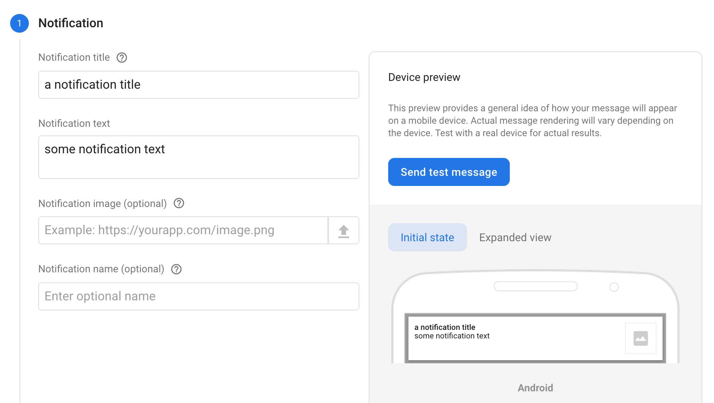
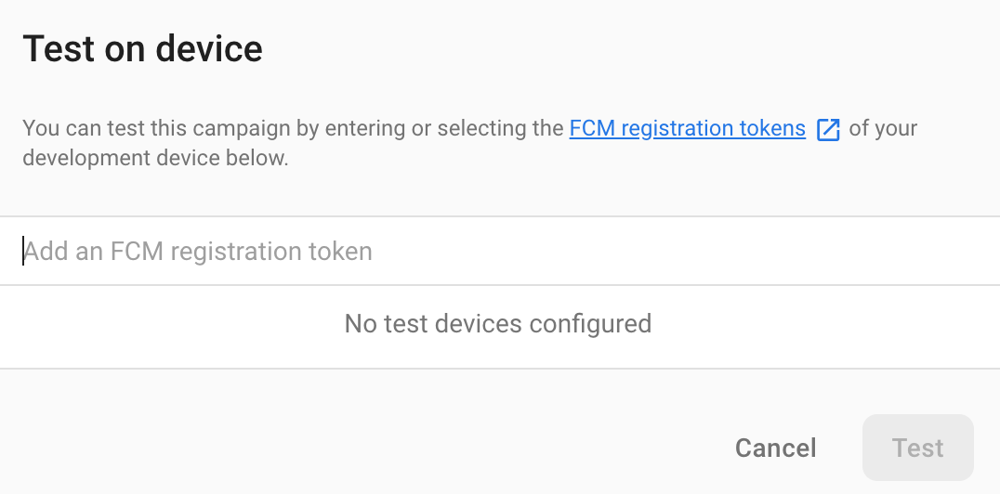

# Debugging

There are a number of different ways to manually test aspects of the app.

## Debug information

You can see the current state of the app's configuration (including the device's FPNS/APNS push token if it has one) by opening the debug view.

* Tap the VPC logo on the connection page 20 times.
* This will take you to the debug view.

The debug view has some useful information about the device:

| Debug info | Notes |
|-|-|
| App version | Record this value when reporting an issue. |
| App build | Version number of the build - should increment between releases. |
| Build | Values: `RELEASE` / `DEBUG` |
| Portal | Values: `LIVE` / `TEST` |
| Push token | If this box is blank, the phone did not manage to register itself with FPNS or APNS. |
| Device | Some useful information about your device and the version of Android or iOS. |

There are also some tools to help debug issues:

| Tool | Notes |
|-|-|
| Export exception logs... | This will allow a user to share the logs from their app with us. |
| Add test notification | This will create a fake notification in the app - to help debug the user interface. |
| Simulate crash | This will trigger an exception - to help confirm that these are captured, and simulate the user experience when something goes wrong. |

If you want to analyse the exception logs from a particular issue that a user experienced, it's a good idea to ask the user for the time that the issue occurred. The logs can be a little verbose at times.

NB. `RELEASE` builds of the app do not capture verbose information or personally identifiable information in the logs.

## Debugging push notifications

* Place a debug point inside the `CheckTokenWithPortalAsync` method in `App.xaml.cs` to capture the portal token.
* With the token, visit the [vpc-connect cloud messaging controls](https://console.firebase.google.com/project/vpc-connect/notification) in Firebase.
* From there you can [compose a new test notification](https://console.firebase.google.com/project/vpc-connect/notification/compose).
* Compose your notification, and use the **Send test message** button to push it to the phone.

## Composing FCM test notifications

The test notifications you can generate in FCM aren't very sophisticated (they are alert / notification types).

To generate more sophisticated types of notification you'll need to access FCM through the API. See [FCM push notification content](push-content.md) for more information about the content of push notifications.

1. Visit the [vpc-connect notification composer](https://console.firebase.google.com/project/vpc-connect/notification/compose).

2. Compose your notification.
  

3. Press the **Send test message** button to see the **Test on device** popover.
  

4. Add the FCM push token for your device, and press the `+` button.

5. Press **Test** to send the message.
