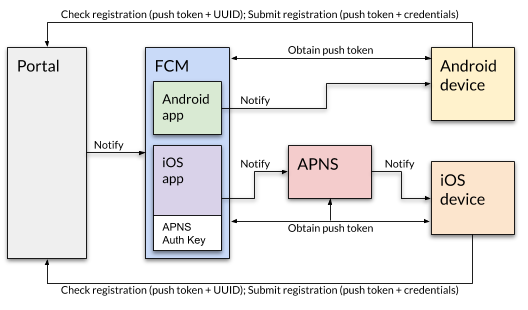

# Infrastructure

Push Notifications operate differently on Android and iOS. Android devices are served directly by the Firebase Cloud Messaging service (FCM). iOS devices are served by the Apple Push Notification Service (APNS).

Messages generated by the portal are delivered to FCM, which then either communicates directly with the recipient Android device, or passes the message on to APNS for handling.

The FCM project [VPC Connect](https://console.firebase.google.com/project/vpc-connect/notification) contains details of the Android and iOS apps.

iOS apps in FCM hold a key called the APNS Auth Key. This permits FCM to communicate with APNS for iOS notifications.
