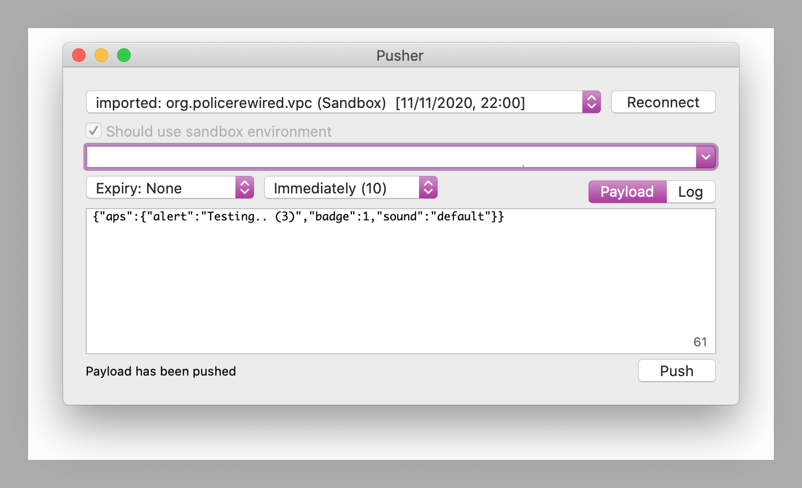

# Push notification configuration

## Configuring FCM to send to APNS

* FCM ([documentation](https://firebase.google.com/docs/cloud-messaging/ios/certs)) relies on an APN authentication key in order to be able to communicate with APN.
* This can be provisioned through the [Apple Developer Member Center](https://developer.apple.com/membercenter/index.action).
* Under FCM, add an __iOS__ app:
  * Provide the Bundle ID: `org.vpc.connect`
  * In the Cloud Messaging section:
    * Add the APNS Authentication key file.
    * Provide Key Id (in the name of the file).
    * Confirm the application Team Id: `XGU7PQB893` 

The app itself manages its Push Notification connection with a few settings:

* Download `GoogleService-Info.plist` from FCM and place in the iOS application, with build action set to BundleResource.
* `Entitlements.plist` has a property called `APS Environment`. Possible values are `development` or `production`.
* In `Info.plist` under `Application` check **Enable background modes** and **Remote notifications**.

### Documentation

* [Receiving messages on iOS](https://firebase.google.com/docs/cloud-messaging/ios/receive)
* [Sending FCM messages](https://firebase.google.com/docs/cloud-messaging/ios/send-with-console)

## Troubleshooting and testing push notifications

The journey is broken into several steps, from __portal server__ to __FCM__, to __APNS__, to __iOS device__, to the __app__ itself.

* Ensure you are using a _development_ APN key to send to an app built with a _development_ certificate.
* Ensure that FCM has the appropriate Bundle Id of the iOS app.
* Ensure that FCM has the iOS app appropriately configured in development/sandbox or production mode.

NB. Apple have two endpoints: `gateway.sandbox.push.apple.com:2195` for development, and `gateway.push.apple.com:2195` for production.

### FCM documentation

* [Understanding message delivery](https://firebase.google.com/docs/cloud-messaging/understand-delivery) (FCM)
* [Debugging FCM Notifications on iOS](https://firebase.googleblog.com/2017/01/debugging-firebase-cloud-messaging-on.html)

### iOS/APNS documentation

* [Enable verbose iOS APN logs](http://atnan.com/blog/2009/07/27/enabling-verbose-push-notification-service-apns-logs/), and view using XCode's Device Organiser.
* [Troubleshooting Push Notifications](https://developer.apple.com/library/archive/technotes/tn2265/_index.html) (Apple developer docs)

### Testing APNS with NWPusher

* Install [NWPusher](https://github.com/noodlewerk/NWPusher) with `brew` or download the .app zip and push a message manually through APNS.
  ```
  brew cask install pusher
  ```
* Open the app, provide the push certificate from Apple Developer Center as a p12 (import to keychain, export as p12).
* Provide the device id (registration token), as listed in the app logs. It's a 64 character string.
* Push!



### APNS Tester (for FCM and APNS)

* This APNS Tester tool can help: https://www.apnstester.com/fcm/

### FCM built in notification composer

* You can also compose a test notification using FCM: [Compose Notification](https://console.firebase.google.com/project/s8080app/notification/compose)
* Provide title and message content
* Use the `Send test message` button
* Provide the device's FCM registration token (not the APNS device id!)
* Use the `Test` button to send a message

### Sending a test message through FCM

* Install and run the app.
* You may need to accept the permission to receive remote notifications.
* Make sure the app is in the background on the device.
* Open the [Notifications composer](https://console.firebase.google.com/project/_/notification) and select: __New notification__
* Enter the message text.
* Select: __Send test message__
* Enter the app's registration token (it's a 64 character string) in: __Add an FCM registration token__
* Click: __Test__

### Performance and logs

* [FCM reporting dashboard](https://console.firebase.google.com/project/_/notification/reporting)
* [FCM Logs viewer](https://console.cloud.google.com/logs/viewer)
